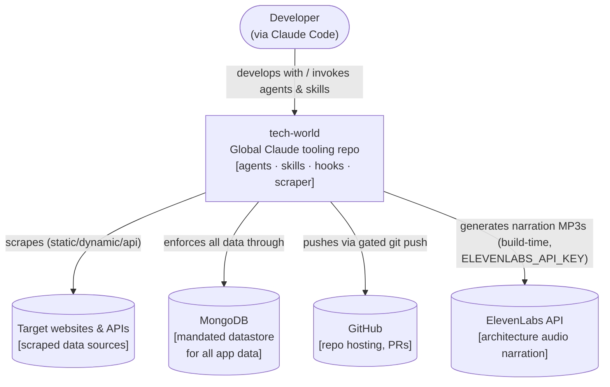
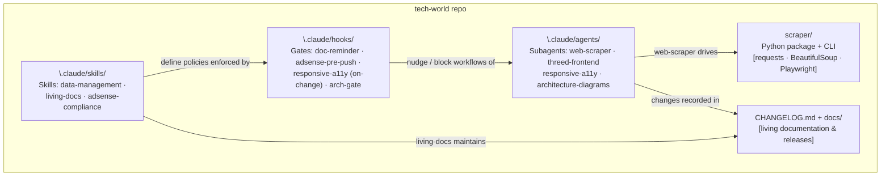
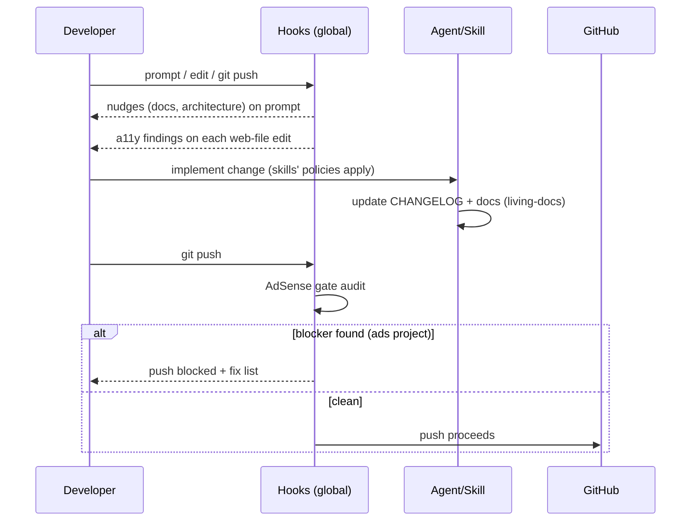

# tech-world — Architecture

> Living document. Update in the same change as any structural modification
> (architecture-diagrams agent policy). Interactive viewer: open
> [`index.html`](./index.html) in a browser.

## Overview & goals

`tech-world` is a **global Claude Code tooling repository**: it version-controls
reusable subagents, skills, and enforcement hooks that are installed to
`~/.claude/` so they apply to *every* project, plus a working Python scraping
toolkit. Goals: (1) make quality policies — documentation, data management,
AdSense compliance, accessibility, architecture-first — automatic rather than
remembered; (2) keep every tool portable and reviewable in git.

## Context (C4 level 1)

## Containers (C4 level 2)

| Container | Technology | Responsibility | Notes |
|-----------|-----------|----------------|-------|
| `scraper/` | Python 3.11, requests, BeautifulSoup, Playwright (opt) | Fetch (static/dynamic/api) + extract + serialize web data | Stateless CLI; retries w/ backoff |
| `.claude/agents/` | Markdown agent definitions | Reusable subagent personas (scraping, 3D frontend, responsive+a11y, architecture) | Installed to `~/.claude/agents/` |
| `.claude/skills/` | SKILL.md + references/scripts | Policy skills: MongoDB-only data, living docs & releases, AdSense compliance | Installed to `~/.claude/skills/` |
| `.claude/hooks/` | Bash + Python, wired in `~/.claude/settings.json` | Automatic enforcement: doc reminders, AdSense push gate, on-change a11y checks, architecture-first gate | Fail-open by design except AdSense push block |
| `docs/` + `CHANGELOG.md` | Markdown, Keep a Changelog / SemVer | Living record of every change; versioned release docs | Maintained by living-docs |

## Key flows

## Data

No runtime datastore in this repo itself. The **data-management skill** mandates
that any application built with these tools stores all data in **MongoDB**
(`MONGODB_URI`/`MONGODB_DB` from env, repository pattern, no hardcoded data, and
no work starts until a connection is confirmed or the user declares the project
a static site).

## Cross-cutting

- **Secrets:** only via environment variables (`MONGODB_URI`,
  `ELEVENLABS_API_KEY`); never in source.
- **Enforcement philosophy:** hooks fail open (never break unrelated work)
  except the AdSense pre-push gate, which blocks only a genuinely
  non-compliant ad-serving project.
- **Docs discipline:** every change lands with a `CHANGELOG.md` entry; releases
  are cut with `cut_release.py` into `docs/releases/vX.Y.Z.md`.

## Decision log

| # | Decision | Why |
|---|----------|-----|
| 1 | MIT license | User choice for open reuse |
| 2 | Mermaid as diagram source of truth | Diffable; renders natively on GitHub & Claude artifacts |
| 3 | React Flow (`@xyflow/react`) for Tier-2 interactive viewers | MIT license; built for interactive node UIs; JointJS gates advanced features behind commercial JointJS+; Cytoscape.js targets graph analysis, not UI editing |
| 4 | ElevenLabs narration generated at build time only | Client-side calls would expose the API key; static MP3s work offline/under CSP |
| 5 | Global install via `~/.claude/` with repo as source of truth | Policies apply to all projects without per-project setup |
